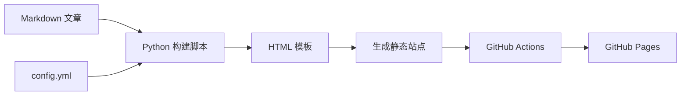
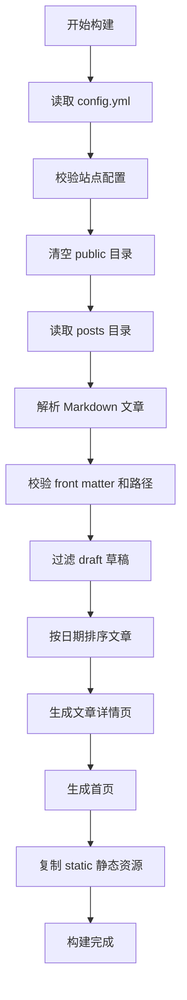
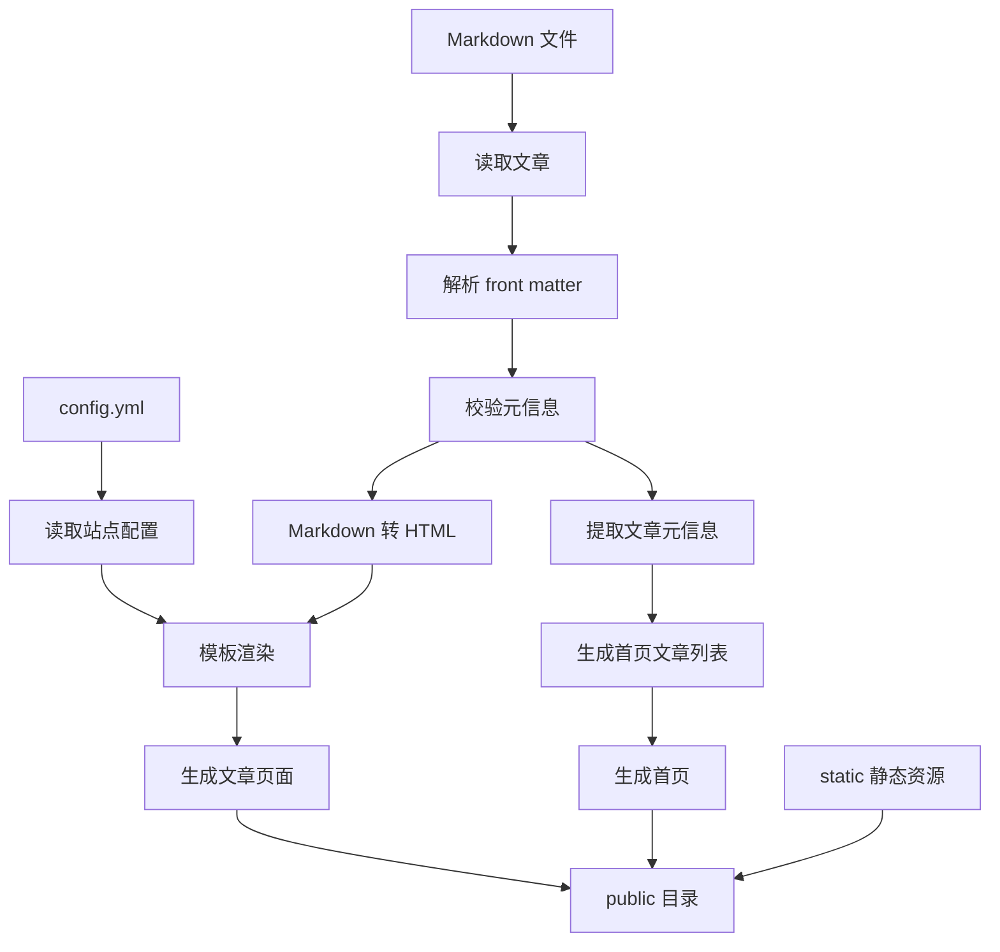

# 个人博客系统概要设计

## 1. 项目概述

本项目旨在实现一个不依赖 Hugo、Hexo、Jekyll 等博客框架的轻量级个人博客系统。系统采用 Markdown 作为文章编写格式，通过 Python 脚本将 Markdown 文件转换为静态 HTML 页面，并结合简单的 HTML/CSS 模板生成完整博客站点。最终站点通过 GitHub Actions 自动构建，并部署到 GitHub Pages。

整体方案如下：

```text
Markdown 写作
+ Python 脚本生成 HTML
+ 简单 HTML/CSS 模板
+ GitHub Actions 部署到 GitHub Pages
```

该方案的核心目标是：结构简单、易于维护、部署方便、可扩展性较好。

本文档定位为概要设计。文档会固定关键规则、边界条件和实现约束，使另一位工程师可以在不额外做关键技术判断的前提下开始实现 `build.py`、模板和 `deploy.yml`，但不会展开为逐函数实现手册。

---

## 2. 设计目标

### 2.1 功能目标

系统应支持以下基本功能：

1. 使用 Markdown 编写博客文章；
2. 自动解析文章标题、日期、标签、摘要等元信息；
3. 自动生成文章详情页；
4. 自动生成首页文章列表；
5. 支持统一页面模板；
6. 支持基础样式美化；
7. 支持 GitHub Actions 自动构建与部署；
8. 支持部署到 GitHub Pages。

### 2.2 非功能目标

系统应满足以下非功能需求：

| 目标 | 说明 |
| ---- | ---- |
| 简洁性 | 不引入完整博客框架，减少依赖 |
| 可维护性 | 文章、模板、样式、构建逻辑、站点配置分离 |
| 可扩展性 | 后续可扩展标签页、归档页、RSS、搜索等功能 |
| 可移植性 | 生成结果为纯静态文件，可部署到 GitHub Pages、Nginx、对象存储等平台 |
| 自动化 | push 到 GitHub 后自动构建和部署 |
| 可验证性 | 构建失败时返回非零退出码，便于 CI 检查 |

---

## 3. 系统总体架构

系统整体采用静态站点生成架构，分为五个核心部分：

1. **内容层**：存放 Markdown 文章；
2. **配置层**：定义站点标题、描述、导航、部署路径等站点级配置；
3. **模板层**：定义 HTML 页面结构；
4. **构建层**：使用 Python 脚本生成静态页面；
5. **部署层**：使用 GitHub Actions 发布到 GitHub Pages。

整体流程如下：



---

## 4. 目录结构设计

项目目录建议如下：

```text
my-blog/
├── posts/
│   ├── hello-world-k3m8p2qx.md
│   └── robot-middleware-7nv4c1za.md
│
├── templates/
│   ├── base.html
│   ├── index.html
│   └── post.html
│
├── static/
│   ├── css/
│   │   └── style.css
│   ├── js/
│   │   └── main.js
│   └── images/
│
├── public/
│   ├── index.html
│   ├── posts/
│   └── static/
│
├── config.yml
├── build.py
├── requirements.txt
├── .gitignore
├── README.md
└── .github/
    └── workflows/
        └── deploy.yml
```

各目录说明如下：

| 目录/文件 | 作用 |
| --------- | ---- |
| `posts/` | 存放 Markdown 博客文章 |
| `templates/` | 存放 HTML 模板文件 |
| `static/` | 存放 CSS、JS、图片等静态资源 |
| `public/` | 存放构建后的静态站点，仅作为构建产物 |
| `config.yml` | 存放站点级配置 |
| `build.py` | Python 构建脚本 |
| `requirements.txt` | Python 依赖列表 |
| `.gitignore` | 忽略 `public/` 等构建产物 |
| `.github/workflows/deploy.yml` | GitHub Actions 自动部署配置 |

目录约束如下：

1. `public/` 为固定输出目录；
2. `public/` 不纳入版本控制，应加入 `.gitignore`；
3. 构建脚本只清理 `public/`，不得修改 `posts/`、`templates/`、`static/`、`config.yml` 等源文件目录。

---

## 5. 站点配置设计

系统使用 `config.yml` 作为站点级配置文件来源。该文件由构建脚本读取，并作为模板渲染的全局输入之一。

推荐示例如下：

```yaml
site_title: My Blog
site_description: 记录技术、阅读与项目实践
base_url: /blog
author: Alice
timezone: Asia/Shanghai
navigation:
  - title: 首页
    url: /
  - title: 关于
    url: /about.html
```

字段定义如下：

| 字段 | 类型 | 是否必需 | 说明 |
| ---- | ---- | ---- | ---- |
| `site_title` | `string` | 是 | 站点标题 |
| `site_description` | `string` | 是 | 站点描述 |
| `base_url` | `string` | 是 | 站点基础路径，用于 GitHub Pages 子路径部署 |
| `author` | `string` | 是 | 默认作者信息 |
| `timezone` | `string` | 是 | 站点时区 |
| `navigation` | `list` | 否 | 导航项列表，元素至少包含 `title` 和 `url` |

配置约束如下：

1. `base_url` 必须显式配置；
2. 若部署到 GitHub 用户主页站点，可配置为 `/`；
3. 若部署到仓库主页站点，例如 `https://user.github.io/blog/`，则 `base_url` 配置为 `/blog`；
4. 模板中的站内链接和静态资源路径必须基于 `base_url` 生成，避免 GitHub Pages 子路径下资源失效；
5. `navigation.url` 表示站内相对站点根路径，渲染时由模板与 `base_url` 拼接。

模板输入来源约定如下：

1. `site_*`、`author`、`timezone`、`navigation` 来自 `config.yml`；
2. `post.title`、`post.date`、`post.tags`、`post.summary`、`post.content`、`post.url` 来自文章 front matter 和正文解析结果；
3. `base_url` 既保留在 `site.base_url` 中，也可单独传入模板，便于直接引用。

---

## 6. 文章路径与命名规则

为确保链接稳定、路径可预测且实现简单，系统固定采用基于文件名的文章命名和输出规则。

### 6.1 源文件命名规则

文章源文件命名格式固定为：

```text
name-xxxxxxxx.md
```

示例：

```text
hello-world-k3m8p2qx.md
robot-middleware-7nv4c1za.md
```

命名规则说明：

1. `name` 只允许小写字母、数字和连字符，由新建文章命令的 `--name` 参数提供；
2. `xxxxxxxx` 为创建文章时生成的 8 位小写字母数字随机后缀；
3. 发布日期只存储在 front matter 的 `date` 字段中；
4. 文章标题允许为中文，但 URL 不直接从中文标题生成；
5. 首页和文章页显示的标题均取 front matter 中的 `title`，而不是文件名。

### 6.2 输出路径规则

系统固定采用以下输出路径：

```text
public/index.html
public/posts/<source-name>.html
```

其中 `<source-name>` 为去掉 `.md` 后的源文件名，例如：

```text
posts/hello-world-k3m8p2qx.md
→ public/posts/hello-world-k3m8p2qx.html
```

采用此方案的原因是：

1. 输出路径与源文件一一对应；
2. 无需在 v1 中额外定义自定义 permalink 规则；
3. 随机后缀能避免同名文章的文件名和 URL 冲突。

### 6.3 冲突处理规则

构建时必须检查以下冲突：

1. 两篇文章生成相同输出路径；
2. 源文件名不符合 `name-xxxxxxxx.md` 规则，其中随机后缀必须为 8 位小写字母数字。

出现任一冲突时，构建直接失败，不自动覆盖、不静默纠正。

---

## 7. 文章格式设计

每篇文章使用 Markdown 编写，并在文件头部使用 front matter 描述文章元信息。

示例：

```markdown
---
title: 我的第一篇博客
date: 2026-07-08
tags: [博客, Markdown, Python]
summary: 这是一篇用于测试个人博客系统的文章。
draft: false
---

# 我的第一篇博客

这里是正文内容。

## 小节标题

这里是文章的具体内容。
```

文章元信息字段设计如下：

| 字段 | 类型 | 是否必需 | 说明 |
| ---- | ---- | ---- | ---- |
| `title` | `string` | 是 | 文章标题 |
| `date` | `string` | 是 | 文章发布日期，格式固定为 `YYYY-MM-DD` |
| `tags` | `list[string]` | 否 | 文章标签列表 |
| `summary` | `string` | 否 | 文章摘要 |
| `draft` | `bool` | 否 | 是否为草稿，草稿不发布 |

front matter 约束如下：

1. `title`、`date` 为必填字段；
2. `date` 必须采用 `YYYY-MM-DD` 格式；
3. `tags` 必须为字符串列表，不接受单个字符串；
4. `draft` 必须为布尔值；
5. `summary` 可选；若未填写，则由构建脚本从正文前若干字自动提取摘要；
6. front matter 必须为合法 YAML。

校验策略如下：

1. 非法 YAML：构建失败；
2. 缺少必填字段：构建失败；
3. 字段类型错误：构建失败；
4. 日期格式非法：构建失败；
5. front matter 中存在未使用字段：允许保留，但 v1 不参与渲染。

---

## 8. 核心模块设计

### 8.1 Markdown 文章解析模块

该模块负责读取 `posts/` 目录下的 Markdown 文件，并解析文章元信息和正文内容。

主要职责：

1. 扫描 `posts/` 目录；
2. 读取 `.md` 文件；
3. 校验文件名格式；
4. 解析 front matter；
5. 校验 `title`、`date`、`tags`、`summary`、`draft`；
6. 提取文章标题、日期、标签、摘要；
7. 过滤草稿文章；
8. 将 Markdown 正文转换为 HTML；
9. 生成文章输出路径和页面 URL。

建议使用的 Python 依赖：

```text
markdown
PyYAML
Jinja2
```

其中：

| 依赖 | 作用 |
| ---- | ---- |
| `markdown` | 将 Markdown 转换为 HTML |
| `PyYAML` | 解析 front matter 和站点配置 |
| `Jinja2` | 渲染 HTML 模板 |

### 8.2 Markdown 渲染能力边界

v1 的 Markdown 渲染能力定义如下：

1. 支持标题、段落、列表、引用、链接、图片、行内代码；
2. 支持 fenced code block；
3. 支持表格；
4. 不在 v1 中内建目录页、数学公式和全文搜索；
5. 代码高亮不作为 v1 必选能力，保留到后续扩展阶段；
6. 正文中允许作者书写原生 HTML，系统默认信任仓库内作者内容，不额外做 HTML sanitize。

推荐启用的 Markdown 扩展：

```text
fenced_code
tables
```

上述边界选择基于“单作者、仓库内容受信任”的前提。若未来支持多人协作投稿，再额外引入内容净化策略。

### 8.3 HTML 模板渲染模块

该模块负责将文章内容填充到 HTML 模板中，生成最终页面。

模板设计建议：

```text
templates/
├── base.html
├── index.html
└── post.html
```

#### base.html

`base.html` 是公共基础模板，包含：

1. HTML 基础结构；
2. 页面 `<head>`；
3. SEO 基础元信息占位；
4. 全站导航栏；
5. 页脚；
6. CSS/JS 引入。

`base.html` 至少应包含以下信息：

1. `<title>`；
2. `<meta name="description">`；
3. `<meta name="viewport" content="width=device-width, initial-scale=1.0">`；
4. 基于 `base_url` 的静态资源引用路径。

#### index.html

`index.html` 用于生成博客首页，展示文章列表。

首页主要内容包括：

1. 博客标题；
2. 简短介绍；
3. 文章列表；
4. 每篇文章的标题、日期、摘要、标签；
5. 指向文章详情页的链接。

模板输入字段至少包括：

```text
site.site_title
site.site_description
site.author
site.navigation
base_url
posts[]
```

其中 `posts[]` 中每篇文章至少包含：

```text
title
date
tags
summary
url
```

#### post.html

`post.html` 用于生成文章详情页。

文章页主要内容包括：

1. 文章标题；
2. 发布日期；
3. 标签；
4. 摘要；
5. 正文内容；
6. 返回首页链接。

模板输入字段至少包括：

```text
site.site_title
site.site_description
site.author
site.navigation
base_url
post.title
post.date
post.tags
post.summary
post.content
post.url
```

### 8.4 静态资源处理模块

该模块负责将 `static/` 目录中的资源复制到 `public/static/`。

主要包括：

1. CSS 文件；
2. JavaScript 文件；
3. 图片资源；
4. 字体文件；
5. 其他附件。

构建时应执行：

```text
static/  →  public/static/
```

资源处理约束如下：

1. 保留源目录结构；
2. 不改写文件内容；
3. 模板中引用静态资源时必须使用 `base_url + /static/...` 形式；
4. `static/` 目录不存在时构建失败。

### 8.5 站点生成模块

该模块是 `build.py` 的核心逻辑，负责生成完整静态站点。

主要流程如下：



生成结果示例：

```text
public/
├── index.html
├── posts/
│   ├── hello-world-k3m8p2qx.html
│   └── robot-middleware-7nv4c1za.html
└── static/
    ├── css/
    │   └── style.css
    ├── js/
    │   └── main.js
    └── images/
```

---

## 9. 页面设计

### 9.1 首页设计

首页主要用于展示博客文章列表。

页面结构如下：

```text
首页
├── 顶部导航
├── 博客标题
├── 博客简介
├── 文章列表
│   ├── 文章标题
│   ├── 发布日期
│   ├── 摘要
│   └── 标签
└── 页脚
```

首页文章列表按发布日期倒序排列。

### 9.2 文章页设计

文章页用于展示单篇博客文章。

页面结构如下：

```text
文章页
├── 顶部导航
├── 文章标题
├── 发布日期
├── 标签
├── 摘要
├── 正文内容
├── 返回首页
└── 页脚
```

### 9.3 样式设计

样式采用简单 CSS 实现，重点保证：

1. 页面排版简洁；
2. 阅读体验良好；
3. 移动端基本适配；
4. 代码块可读性较好；
5. 链接、标题、列表等元素风格统一。

基础样式文件：

```text
static/css/style.css
```

---

## 10. 构建流程设计

本地构建流程如下：

```bash
pip install -r requirements.txt
python build.py
```

构建过程：

1. 读取并校验 `config.yml`；
2. 删除旧的 `public/` 目录；
3. 创建新的 `public/` 目录；
4. 读取所有 Markdown 文章；
5. 校验文件名、front matter 和输出路径；
6. 将 Markdown 转换为 HTML；
7. 使用模板生成文章页面；
8. 使用模板生成首页；
9. 复制静态资源；
10. 输出完整静态站点。

构建校验规则如下：

1. `config.yml` 不存在：构建失败；
2. `templates/` 缺少 `base.html`、`index.html` 或 `post.html`：构建失败；
3. `posts/` 不存在：构建失败；
4. `static/` 不存在：构建失败；
5. 存在非法 YAML、非法日期、非法字段类型：构建失败；
6. 存在重复输出路径或路径冲突：构建失败；
7. 构建失败时脚本必须返回非零退出码。

输出约束如下：

1. 仅允许写入 `public/` 目录；
2. 不允许修改文章源文件；
3. 不允许在构建成功后保留部分旧文件；
4. `public/` 为纯构建产物，不提交到仓库。

---

## 11. 本地开发与预览

推荐的本地开发流程如下：

```bash
pip install -r requirements.txt
python build.py
python -m http.server 8000 --directory public
```

开发者可在浏览器中访问：

```text
http://localhost:8000
```

本地预览约束如下：

1. 本地预览使用 `public/` 作为站点根目录；
2. 若 `base_url` 配置为仓库子路径，本地模板仍应通过统一的路径拼接策略正确引用资源；
3. 模板和构建逻辑应避免硬编码生产域名；
4. 本地预览仅用于验证页面结构、样式和资源路径，不替代 CI 部署验证。

---

## 12. 部署流程设计

系统通过 GitHub Actions 自动部署到 GitHub Pages。

部署流程如下：


开发者只需要执行：

```bash
git add .
git commit -m "docs: update design"
git push
```

之后 GitHub Actions 会自动完成构建与部署。

部署约束如下：

1. 使用 GitHub Pages 官方 Actions 部署方式；
2. 不采用手工推送 `gh-pages` 分支的方式；
3. 站点路径差异统一通过 `base_url` 处理；
4. 构建产物固定为 `public/`。

---

## 13. GitHub Actions 设计

建议使用 `.github/workflows/deploy.yml` 配置自动部署。

推荐 workflow 策略如下：

1. 触发条件：push 到 `main` 分支；
2. 构建环境：Python 3.12；
3. 执行顺序：拉取代码、安装 Python、安装依赖、执行 `python build.py`、上传 `public/`、部署到 Pages；
4. Pages 权限：允许 workflow 写入 Pages 并使用 `id-token`；
5. 发布目标：GitHub Pages 官方部署目标。

配置目标：

```text
源文件：posts/、templates/、static/、config.yml、build.py
构建结果：public/
部署目标：GitHub Pages
触发分支：main
```

说明如下：

1. 若仓库为用户主页站点，`base_url` 配置为 `/`；
2. 若仓库为项目主页站点，`base_url` 配置为仓库名路径；
3. workflow 不负责重写 HTML 链接，链接规则由构建脚本和模板统一处理。

---

## 14. 数据流设计

博客系统的数据流如下：



---

## 15. 关键文件说明

### 15.1 build.py

`build.py` 是系统核心文件，主要职责包括：

1. 读取站点配置；
2. 清理输出目录；
3. 读取文章；
4. 校验元信息和路径；
5. 转换 Markdown；
6. 渲染模板；
7. 生成页面；
8. 复制静态资源；
9. 在失败时返回非零退出码。

建议将其内部逻辑拆分为以下函数：

```text
load_site_config()
load_posts()
parse_front_matter()
validate_post()
render_post()
render_index()
copy_static()
build_site()
```

### 15.2 config.yml

站点级配置文件，提供全局输入数据。

主要包括：

1. `site_title`
2. `site_description`
3. `base_url`
4. `author`
5. `timezone`
6. `navigation`

### 15.3 templates/base.html

基础模板，提供统一页面框架。

主要包括：

1. 页面标题；
2. SEO 元信息；
3. CSS 引用；
4. 导航栏；
5. 主内容区域；
6. 页脚；
7. JavaScript 引用。

### 15.4 templates/index.html

首页模板，接收文章列表数据。

输入数据包括：

```text
site
base_url
posts
```

其中每篇 `post` 至少包含：

```text
title
date
tags
summary
url
```

### 15.5 templates/post.html

文章详情页模板，接收单篇文章数据。

输入数据包括：

```text
site
base_url
post
```

其中 `post` 至少包含：

```text
title
date
tags
summary
content
url
```

---

## 16. 后续扩展设计

系统后续可以逐步扩展以下功能：

| 功能 | 实现思路 |
| ---- | ---- |
| 标签页 | 根据文章 `tags` 自动生成标签索引 |
| 归档页 | 按年份、月份对文章分组 |
| RSS | 构建时生成 `rss.xml` |
| sitemap | 构建时生成 `sitemap.xml` |
| 代码高亮 | 引入 `highlight.js` 或 Python Markdown 扩展 |
| 数学公式 | 引入 MathJax 或 KaTeX |
| 全文搜索 | 构建时生成 `search.json`，前端 JS 搜索 |
| 评论系统 | 接入 Giscus 或 Utterances |
| 分页 | 首页文章较多时分页展示 |
| 文章目录 | 根据 Markdown 标题自动生成 TOC |

说明：

1. `draft: true` 草稿过滤已属于 v1 能力，不再作为后续扩展项；
2. 代码高亮在 v1 中不是必选能力，因此保留在后续扩展中统一设计；
3. 若后续支持自定义 permalink，可在此基础上扩展 URL 规则。

---

## 17. 技术选型

| 模块 | 技术 |
| ---- | ---- |
| 文章格式 | Markdown |
| 元信息格式 | YAML front matter |
| 站点配置格式 | YAML |
| 构建语言 | Python |
| Markdown 转换 | `markdown` |
| 模板引擎 | Jinja2 |
| 元信息解析 | PyYAML |
| 页面样式 | HTML + CSS |
| 自动化部署 | GitHub Actions |
| 托管平台 | GitHub Pages |

---

## 18. 系统特点

该方案具有以下特点：

1. **轻量**：不依赖完整博客框架；
2. **透明**：构建逻辑完全可控；
3. **易维护**：文章、配置、模板、样式分离；
4. **易部署**：生成纯静态文件，可直接部署到 GitHub Pages；
5. **易扩展**：后续可以按需增加标签、归档、搜索、RSS 等功能；
6. **适合学习**：能够清楚理解静态博客系统的基本原理；
7. **可落地**：关键输入、路径规则、失败策略和部署方式已固定。

---

## 19. 总结

本系统采用 Markdown 作为内容源，YAML 作为站点配置与文章元信息格式，Python 脚本作为构建工具，HTML/CSS 模板作为页面展示层，GitHub Actions 作为自动化部署工具，GitHub Pages 作为静态站点托管平台。

该方案不依赖 Hugo、Hexo、Jekyll 等现成博客框架，但仍然能够实现一个完整、可维护、可自动部署的个人博客系统。通过补齐站点配置、URL 规则、front matter 校验、模板输入、构建失败策略和 GitHub Pages 部署细节，本文档已经达到可直接指导实现 v1 的程度。
